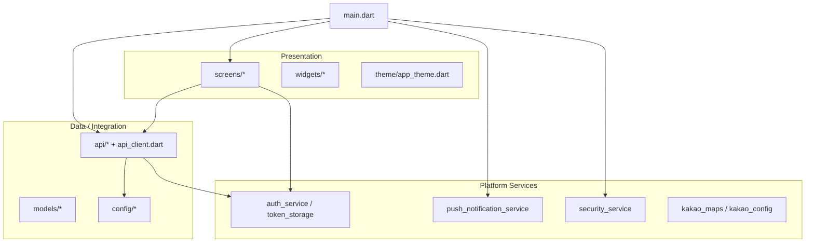

<div align="center">

# 일등대리 (ride_fe)

**대리운전 고객용 모바일 앱** — Flutter · Android / iOS

[](https://flutter.dev)
[](https://dart.dev)
[]()

</div>

---

## 목차

- [개요](#개요)
- [기능 하이라이트](#기능-하이라이트)
- [기술 스택](#기술-스택)
- [아키텍처](#아키텍처)
- [프로젝트 구조](#프로젝트-구조)
- [UI · 디자인 시스템](#ui--디자인-시스템)
- [환경 변수 · 시크릿](#환경-변수--시크릿)
- [로컬 실행](#로컬-실행)
- [빌드 · 배포](#빌드--배포)
- [문서](#문서)
- [Firebase (Android)](#firebase-android)

---

## 개요

일등대리는 **전화(1668-0001)와 앱**으로 대리운전을 이용할 수 있는 **고객용** 클라이언트입니다.  
백엔드 REST API(` /api/v1/ `)와 통신하고, 지도·결제·푸시·보안 검사 등 모바일 네이티브 기능을 연동합니다.

| 항목 | 내용 |
|------|------|
| 패키지명 (`pubspec`) | `number_one_daeri_user_app` |
| 최소 Dart SDK | `^3.11.1` ( `pubspec.yaml` 의 `environment` 참고 ) |
| UI 프레임워크 | Flutter (Material 3) |

---

## 기능 하이라이트

- 온보딩: 권한, 약관, 휴대폰 인증, 추천인(선택)
- 홈: 호출 진입, 공지/배너, 친구 추천·마일리지 안내
- **지도 기반 호출** (Kakao Map SDK)
- 운행 내역, 마일리지·출금, 카드 등록·결제 (**PortOne** 등)
- 쿠폰함, 이벤트/광고 피드, 공지·FAQ·1:1 문의·불편신고
- **FCM** 푸시 · 로컬 알림
- **보안**: 루트/에뮬/변조 감지, Release 시 **SSL 핀닝** 옵션, 토큰 보관 등

---

## 기술 스택

| 영역 | 선택 |
|------|------|
| **앱** | Flutter 3.x, Material 3 |
| **언어** | Dart 3.11+ |
| **네트워크** | Dio, 인터셉터(토큰·refresh), 타임아웃 |
| **보안·저장** | `flutter_secure_storage`, `local_auth`, `flutter_security_suite`, `encrypt`, Release SSL 핀닝(`connect_secure` + `API_CERT_PIN`) |
| **환경** | `flutter_dotenv` (`.env` / `assets/env_defaults.env`) |
| **지도·위치** | `kakao_maps_flutter`, `geolocator` |
| **결제** | `portone_flutter_v2`, `flutter_inappwebview` |
| **푸시** | `firebase_core`, `firebase_messaging`, `flutter_local_notifications` |
| **UX** | `google_fonts`, `phosphor_flutter`, `gap`, `flutter_animate`, `skeletonizer`, `snackly` |
| **기타** | `url_launcher`, `share_plus`, `permission_handler`, `connectivity_plus` |

---

## 아키텍처

**레이어드 + 기능 폴더** 형태를 따릅니다. 화면은 `screens/`, 공통 API는 `api/`, 전역 서비스는 `services/`, 라우팅은 `main.dart`의 named routes와 `routes/` 보조.



**데이터 흐름 (요약)**

1. `main.dart`에서 `dotenv` → `ApiClient.init()` → 보안 검사 → Kakao Map / FCM 초기화  
2. `ApiClient`가 `apiBaseUrl`과 인증 헤더를 주입하고, 401 시 `onAuthRequired`로 로그인 플로우 복귀  
3. 각 화면이 `*Api` 클래스를 호출하고, 모델·UI 상태로 반영  

---

## 프로젝트 구조

```
ride_fe/
├── android/                 # Android 네이티브 (Gradle Kotlin DSL, 서명 key.properties)
├── ios/                     # iOS
├── lib/
│   ├── api/                 # REST 클라이언트 래퍼 (rides, auth, mileage, …)
│   ├── config/              # API Base URL, PortOne, Kakao, 미디어 URL 등
│   ├── models/              # DTO / 엔티티
│   ├── routes/              # 일부 라우트 헬퍼 (대시보드 등)
│   ├── screens/             # 기능별 화면 (home, call, payment, coupon, …)
│   ├── services/            # 인증, 푸시, 보안, 연결 상태 등
│   ├── theme/               # AppTheme (색·타이포·컴포넌트 테마)
│   ├── utils/               # 공통 유틸 (반응형, 포맷 등)
│   ├── widgets/             # 재사용 위젯
│   └── main.dart            # 엔트리, 전역 라우트 테이블
├── assets/                  # 이미지, 아이콘, 맵 에셋, env 기본값
├── docs/                    # 내부 참고 문서 (예: 앱 혜택 문구 정리)
├── pubspec.yaml
└── README.md
```

---

## UI · 디자인 시스템

`lib/theme/app_theme.dart`에 **단일 소스**로 정의되어 있습니다.

| 토큰 | 용도 | 값 (개념) |
|------|------|-----------|
| **Primary Dark** | 브랜드 네이비, 앱바 아이콘/제목, 주요 버튼 배경 | `#0D1B48` |
| **Accent Yellow** | CTA·배지·강조 블록 | `#FFD54F` |
| **Accent Blue** | 링크·보조 강조, 온보딩 그라데이션 | `#2196F3` |
| **Surface Grey** | 스캐폴드 배경 | `#F5F6FA` |
| **Border / Text secondary** | 카드 테두리, 보조 텍스트 | `#E8EAF0` / `#8A93A6` |

**원칙**

- **Material 3** + 라이트 모드 중심, 카드는 **낮은 elevation + 라운드 16 + 얇은 보더**로 정리된 레이아웃
- **타이포**: `google_fonts` + 테마 `textTheme` 보강, `ResponsiveLayout`으로 **텍스트 스케일 클램프** (`main.dart` `builder`)
- **아이콘**: Phosphor (`phosphor_flutter`)로 메뉴·상태 일관성
- **간격**: `gap` 패키지로 수직 리듬 통일

스크린샷은 저장소 용량 정책에 맞춰 `docs/screenshots/` 등에 두고 README에서 링크하는 방식을 권장합니다.

---

## 환경 변수 · 시크릿

| 변수 / 파일 | 설명 |
|-------------|------|
| `.env` (로컬) | `API_BASE_URL`, 카카오/포트원 키, `API_CERT_PIN` 등 — **커밋 금지** |
| `assets/env_defaults.env` | `.env` 없을 때 폴백 |
| `--dart-define=API_BASE_URL=...` | CI/릴리즈에서 API 호스트 주입 ( `api_config.dart` 우선순위 상단 ) |
| `android/key.properties` + keystore | Play 업로드 서명 — **gitignore** |
| `android/app/google-services.json` | FCM — **커밋하지 않음** (아래 섹션) |

---

## 로컬 실행

```bash
flutter pub get
# 프로젝트 루트에 .env 생성 (API_BASE_URL 등)
flutter run
```

- 디버그 기본 API: `http://127.0.0.1:5174/api/v1/` ( `lib/config/api_config.dart` 참고 )  
- USB 실기기에서 로컬 API: `adb reverse tcp:5174 tcp:5174` 등으로 맞춤  

---

## 빌드 · 배포

```bash
# Android App Bundle (Play Console)
flutter build appbundle --release --dart-define=API_BASE_URL=https://your-host/api/v1/

# iOS (Xcode 아카이브 파이프라인과 병행)
flutter build ipa --release --dart-define=API_BASE_URL=...
```

- Android `versionCode`는 `pubspec.yaml`의 `+빌드번호` — Play 업로드마다 **단조 증가** 필요  
- 패키지명·서명은 `android/app/build.gradle.kts` 및 `key.properties`와 Play Console 등록 정보를 일치시킬 것  

---

## 문서

| 문서 | 내용 |
|------|------|
| [docs/app-benefits-copy.md](docs/app-benefits-copy.md) | 앱 화면에 표기된 **혜택·금액 문구** 정리 (기획·CS 참고) |
| [tool/README-build.md](tool/README-build.md) | 빌드 관련 도구 메모 (있는 경우) |

---

## Firebase (Android)

`android/app/google-services.json`은 **저장소에 커밋하지 않습니다.**

- **로컬**: Firebase 콘솔에서 받은 파일을 `android/app/`에 두고 빌드  
- **CI**: 시크릿에 파일 내용을 저장한 뒤, 빌드 스텝에서 `android/app/google-services.json`으로 생성  

---

## 기여 · 라이선스

내부/비공개 프로젝트인 경우 상위 조직의 **라이선스·기여 가이드**를 여기에 링크하세요.  
공개 오픈소스로 전환 시 `LICENSE` 파일과 이 섹션을 업데이트하면 됩니다.

---

<div align="center">

**Built with Flutter**

</div>
